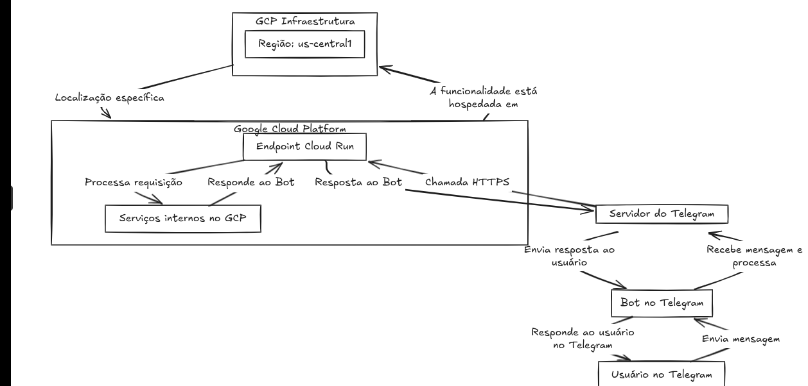

# Assistente de Aluguel de Patinetes para Telegram

Este projeto é um chatbot para Telegram que atua como um assistente de uma empresa de aluguel de patinetes elétricos. O bot é construído com Java 21, Spring Boot, LangChain4j e a API do Google Gemini. A aplicação é projetada para ser implantada de forma segura e escalável no Google Cloud Run.

## Arquitetura da Solução

A interação do usuário começa no Telegram, passa por um webhook seguro, é processada pelo serviço no Cloud Run que utiliza o Gemini para gerar respostas, e retorna ao usuário.



## Tecnologias Utilizadas

Este projeto integra um conjunto de tecnologias modernas para criar uma solução de IA robusta e escalável:

- **Spring Boot 3.2**: Framework principal para a criação da aplicação web, fornecendo um ecossistema completo com injeção de dependências, configuração automática e um servidor web embarcado (Tomcat).
- **LangChain4j 1.7**: O coração da lógica de IA. Este framework facilita a orquestração de chamadas para grandes modelos de linguagem (LLMs), gerenciamento de memória de chat e a criação de ferramentas personalizadas.
  - `langchain4j-spring-boot-starter`: Simplifica a integração do LangChain4j com o Spring, permitindo a configuração de assistentes e ferramentas através de anotações.
  - `langchain4j-google-ai-gemini-spring-boot-starter`: Provê a integração específica com a família de modelos Gemini do Google AI.
- **TelegramBots Spring Boot Starter 6.9**: Biblioteca que facilita a comunicação com a API do Telegram, permitindo a criação de bots baseados em Webhook de forma simples e integrada ao Spring.
- **Java 21**: Utiliza a versão mais recente do Java, aproveitando suas melhorias de performance e recursos de linguagem.
- **Maven**: Gerenciador de dependências e ferramenta de build do projeto.
- **Docker**: Utilizado para containerizar a aplicação, garantindo um ambiente de execução consistente e facilitando o deploy.
- **Google Cloud Run & Artifact Registry**: Plataforma serverless para a execução do contêiner e registro seguro para o armazenamento da imagem Docker.
- **GitHub Actions**: Utilizado para a automação do processo de CI/CD (Integração e Entrega Contínua).

## Funcionalidades

- **Integração com Telegram**: Responde a mensagens de usuários diretamente no Telegram através de um webhook.
- **Segurança**: O endpoint do webhook é protegido usando um token secreto (`X-Telegram-Bot-Api-Secret-Token`) para garantir que apenas o Telegram possa enviar requisições.
- **Assistente Especializado com IA**: Utiliza o LangChain4j e o Google Gemini para interpretar as mensagens dos usuários e fornecer respostas inteligentes e contextuais.
- **Gerenciamento de Credenciais**: As credenciais e tokens são gerenciados de forma segura através de secrets no GitHub e injetados como variáveis de ambiente no Google Cloud Run, não sendo expostos no código-fonte.
- **Deploy Automatizado com GitHub Actions**: O processo de build da imagem Docker, envio para o Artifact Registry e deploy no Cloud Run é totalmente automatizado.

## Configuração e Deploy

O deploy da aplicação é automatizado com GitHub Actions.

### Passo 1: Configurar os Secrets no GitHub

Para que o deploy automatizado funcione, você precisa configurar os seguintes secrets no seu repositório do GitHub (`Settings > Secrets and variables > Actions`):

- `GCP_PROJECT_ID`: O ID do seu projeto no Google Cloud.
- `GCP_SA_KEY`: A chave da conta de serviço do Google Cloud em formato JSON, codificada em Base64.
- `GEMINI_API_KEY`: Sua chave de API para o Google Gemini.
- `TELEGRAM_BOT_TOKEN`: O token do seu bot do Telegram.
- `TELEGRAM_SECRET_TOKEN`: Um token secreto que você cria para proteger seu webhook.

O workflow de deploy, localizado em `.github/workflows/main.yml`, utilizará esses secrets para autenticar e configurar a aplicação no Google Cloud Run.

### Passo 2: Trigger do Deploy

O deploy é acionado automaticamente sempre que um push é feito para a branch `main`. Você pode monitorar o progresso na aba "Actions" do seu repositório.

### Passo 3: Configurar o Webhook do Telegram

Após o primeiro deploy bem-sucedido, o GitHub Actions exibirá a URL do serviço no Cloud Run. Você precisa informar ao Telegram para onde enviar as mensagens. Use o comando `curl` abaixo, substituindo os placeholders:

```bash
curl -F "url=URL_DO_SEU_SERVICO/webhook" \
     -F "secret_token=SEU_SECRET_TOKEN_CONFIGURADO_NO_GITHUB" \
     https://api.telegram.org/botSEU_TOKEN_DO_BOT_AQUI/setWebhook
```

## Agradecimentos Especiais

Este projeto foi fortemente inspirado e utilizou conhecimentos dos seguintes recursos da comunidade:

- **Michelli Brito**: Pelo excelente conteúdo e projetos sobre LangChain4j.
  - [Repositório no GitHub](https://github.com/MichelliBrito/langchain4j)
- **Dev Soutinho (Mario Souto)**: Pelo vídeo inspirador sobre a criação de um bot com IA.
  - [Vídeo no YouTube](https://www.youtube.com/watch?v=A5i7D7RAPA4)

## Referências Oficiais

- **Documentação do LangChain4j**: [https://docs.langchain4j.dev/](https://docs.langchain4j.dev/)
